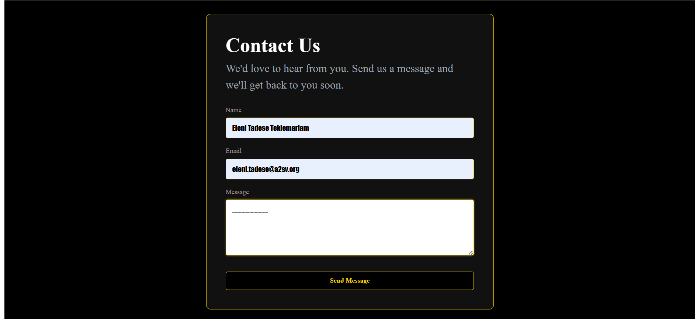

# Contact Form with React Hook Form

A simple and responsive contact form built with React, TypeScript, and React Hook Form.

## Description

This project is a simple contact form created as part of Task 5.
The purpose of the project is to understand how to use the `useForm` hook from React Hook Form to manage form fields, validate user input, display validation errors, and handle form submission.

## Features

- Name field with required validation
- Email field with required and email format validation
- Message field with required validation
- Displays error messages for invalid input
- Handles form submission using React Hook Form
- Responsive user interface
- CSS styling

## Technologies Used

- React
- TypeScript
- React Hook Form
- CSS
- Vite

## Project Structure

```
src/
├── Page/
│   ├── ContactForm.tsx
│   └── ContactForm.css
└── App.tsx
```

## How to Run the Project

1. Clone the repository
   ```bash
   git clone https://github.com/Eleni-tadese/react-hook-form.git
   ```

2. Go into the project directory
   ```bash
   cd react-hook-form
   ```

3. Install the dependencies
   ```bash
   npm install
   ```

4. Start the development server
   ```bash
   npm run dev
   ```

   Then open the local URL shown in the terminal.

## Form Validation

The form validates:

- Name must not be empty.
- Email must not be empty and must have a valid email format.
- Message must not be empty.

When a field is invalid, an appropriate error message is displayed below the field.
## Screenshot

